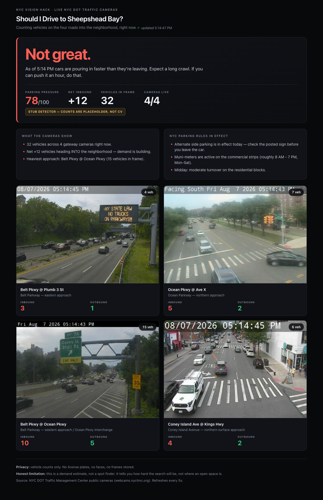

# Should I Drive to Sheepshead Bay?

**Live demo (Cloud Run):** _paste your service URL here after deploying_

An agent that answers one question honestly: **is it worth driving into Sheepshead Bay,
Brooklyn right now to look for parking?**

It reads live NYC DOT traffic cameras positioned on the four roads *into* the neighborhood,
counts vehicles heading in versus heading out, folds in the NYC parking regulations that are
actually in effect at this moment, and returns a plain-English verdict.

Not a dashboard of numbers. An answer: *"Yes — go now."* or *"No — don't bother."*



---

## The honest limitation

**This is a demand estimate, not a spot finder.**

It cannot see an open parking space. There is no camera pointed at the curb you want. What it
can see is the flow of cars into a neighborhood, which is the leading indicator of how hard
the search is about to be. It tells you whether to expect a 2-minute loop or a 20-minute crawl.

It will not tell you where to park. Anyone claiming otherwise from public traffic cameras is
overselling.

Secondary limitations, stated plainly:

- The inbound/outbound split uses a coarse left/right frame heuristic per camera, not surveyed
  lane geometry. A camera whose view was re-aimed by NYC DOT would silently mis-attribute direction.
- The scoring weights in `verdict.py` are hand-tuned intuition. There is no labeled dataset of
  "how long did it actually take to park here at time T," so nothing is calibrated against truth.
- Four cameras is a thin sample of a neighborhood's road network. They are the main gateways,
  not all of them.

## Privacy stance

**Vehicle counts only. No plates, no faces.**

- The pipeline counts vehicles. It does not read license plates. It does not detect, match,
  or store faces.
- Frames live in memory for a few seconds and are never written to disk or to any database.
- The only thing that leaves the detector is an integer.
- The camera feeds are public NYC DOT infrastructure at 352x240 — a resolution at which
  individual identification is not meaningfully possible, and we do not attempt it regardless.

## Architecture

1. `cameras.py` — four NYC DOT gateway cameras into Sheepshead Bay; async JPEG fetch with a 3s TTL cache so a room full of demo viewers doesn't hammer the public API.
2. `detect.py` — `count_vehicles(jpeg_bytes) -> {inbound, outbound, total}`. The one seam a real detector plugs into.
3. `verdict.py` — combines weighted inbound pressure with live NYC parking rules (alternate side, meter hours, time of day) into a 0-100 pressure score and English phrasing.
4. `main.py` — FastAPI: HTML demo page, JSON API, and a JPEG proxy that sidesteps browser CORS/mixed-content.
5. `Dockerfile` — `python:3.12-slim`, binds `0.0.0.0:$PORT`, deployed on **Google Cloud Run**.

```
Browser ──▶ FastAPI (Cloud Run)
                │
                ├─▶ NYC DOT cameras ──▶ detect.count_vehicles() ──┐
                │                                                  ▼
                └─▶ NYC parking rules ──────────────────▶ verdict.build_verdict()
                                                                   │
                                                          plain-English answer
```

## The cameras

| Camera | Approach |
|---|---|
| Belt Pkwy @ Plumb 3 St | Belt Parkway, eastern approach |
| Ocean Pkwy @ Ave X | Ocean Parkway, northern approach |
| Belt Pkwy @ Ocean Pkwy | Belt Parkway western / Ocean Pkwy interchange |
| Coney Island Ave @ Kings Hwy | Coney Island Avenue, northern surface approach |

Source: NYC DOT Traffic Management Center public camera API (`webcams.nyctmc.org`).
Public, no authentication, no API key.

## Run it locally

```bash
python3 -m venv .venv
.venv/bin/pip install -r requirements.txt
.venv/bin/uvicorn app.main:app --host 0.0.0.0 --port 8080
```

Open <http://localhost:8080>. Or `make install && make run`.

Verify every route: `make smoke`

```bash
curl localhost:8080/healthz                                    # {"ok": true}
curl localhost:8080/api/verdict                                # full JSON
curl localhost:8080/api/frame/111e79a9-eb5a-44d0-b062-481ac0a81901 -o frame.jpg
```

### Run the container locally

```bash
docker build -t sheepshead-bay .
docker run --rm -p 8080:8080 -e PORT=8080 sheepshead-bay
```

## Deploy to Google Cloud Run

One-time setup:

```bash
gcloud auth login
gcloud config set project YOUR_PROJECT_ID
gcloud services enable run.googleapis.com cloudbuild.googleapis.com artifactregistry.googleapis.com
```

**Simplest form** — `--source .` builds and deploys in one step. Because a `Dockerfile`
exists at the repo root, Cloud Build uses it automatically (buildpacks are only used when
there is no Dockerfile):

```bash
gcloud run deploy sheepshead-bay \
  --source . \
  --region us-east1 \
  --allow-unauthenticated \
  --port 8080
```

**Explicit Dockerfile form** — build the image, then deploy it:

```bash
gcloud builds submit --tag gcr.io/YOUR_PROJECT_ID/sheepshead-bay .

gcloud run deploy sheepshead-bay \
  --image gcr.io/YOUR_PROJECT_ID/sheepshead-bay \
  --region us-east1 \
  --allow-unauthenticated \
  --port 8080 \
  --memory 512Mi \
  --max-instances 5
```

Or just: `./deploy.sh` (or `make deploy`).

### Flags that matter

| Flag | Why |
|---|---|
| `--allow-unauthenticated` | Without it the judges get a 403. Non-negotiable for a public demo. |
| `--region us-east1` | Keeps latency to the NYC DOT API low. |
| `--port 8080` | Must match what the container listens on. Cloud Run injects `$PORT`; the Dockerfile honors it and binds `0.0.0.0`. |
| `--max-instances 5` | Caps spend if the demo gets traffic. |

Get the URL back any time: `make url`. Tail logs: `make logs`.

## Configuration

No secrets in this repo. Everything is read from environment variables.

| Variable | Default | Purpose |
|---|---|---|
| `PORT` | `8080` | Injected by Cloud Run. The server binds `0.0.0.0:$PORT`. |
| `DETECTOR` | `stub` | `stub` = placeholder counts. `zones` = real detector in `traffic/counter.py` (ROI polygons per camera). |
| `ROBOFLOW_API_KEY` | _unset_ | When set with `DETECTOR=zones`, uses Roboflow hosted inference. Never committed. |
| `RF_MODEL_ID` | `coco/50` | Model slug for the hosted detector. |
| `YOLO_WEIGHTS` | `yolo11s.pt` | Local YOLO weights, used when `DETECTOR=zones` and no Roboflow key. |

`DETECTOR=zones` requires the detector's dependencies to be present. They are **not** in this
service's `requirements.txt` — the base image stays small and the build stays under 10s. If the
backend can't load, the service degrades to the stub and **says so**: `/api/verdict` reports
`detector.backend: "stub (requested 'zones', unavailable)"` and `is_stub: true`.

Set them on Cloud Run with `--set-env-vars`, or better, `--set-secrets` from Secret Manager:

```bash
gcloud run services update sheepshead-bay --region us-east1 \
  --set-env-vars DETECTOR=roboflow \
  --set-secrets ROBOFLOW_API_KEY=roboflow-key:latest
```

## API

| Route | Returns |
|---|---|
| `GET /` | Self-contained HTML demo page. No CDN, inline CSS, auto-refreshes every 5s. |
| `GET /healthz` | `{"ok": true}` — Cloud Run health check. Never touches upstream. |
| `GET /api/verdict` | Verdict, per-camera counts, timestamps, camera image URLs. |
| `GET /api/frame/{camera_id}` | Proxies the live JPEG (avoids browser CORS / mixed-content). |
| `GET /api/cameras` | Static gateway camera config. |
| `GET /docs` | OpenAPI docs, free from FastAPI. |

## Status: what's real, what's stubbed

**Real and working now:**
- Live NYC DOT camera fetching, concurrent, cached, with stale-frame fallback when upstream flakes.
- The JPEG proxy, the JSON API, the HTML demo, the health check.
- NYC parking regulation logic — alternate side, meter hours, time-of-day and weekend effects.
- The verdict scoring model and phrasing.
- `_split_by_direction()` in `detect.py` — real geometry logic, already testable; only its input is stubbed.

**Stubbed, clearly marked in code and in the UI:**
- `detect.count_vehicles()` returns placeholder counts derived from a hash of the frame bytes.
  They move as the live image changes and are deterministic per frame, but **they are not
  computer vision.** The API response carries `detector.is_stub: true` and the web UI displays
  a "Stub detector" badge so nobody mistakes it for real detections.

The seam is deliberately narrow: a real detector drops in behind
`count_vehicles(jpeg_bytes, inbound_side, camera_id) -> {"inbound", "outbound", "total"}`
without touching any other file. `_count_via_zones()` is the live adapter onto the real counter
in `traffic/counter.py` — flip `DETECTOR=zones` and install that detector's deps to switch over.

The stub never lies about itself. `is_stub()` reports the **runtime** truth, not the configured
intent: if a real backend is requested but fails to load, the API and the UI both still say
"stub." A demo claiming real detection while serving hashed placeholders would be worse than
one that admits it.

## License

MIT

---

Built for NYC Vision Hack. Data: NYC DOT Traffic Management Center public camera feeds.
